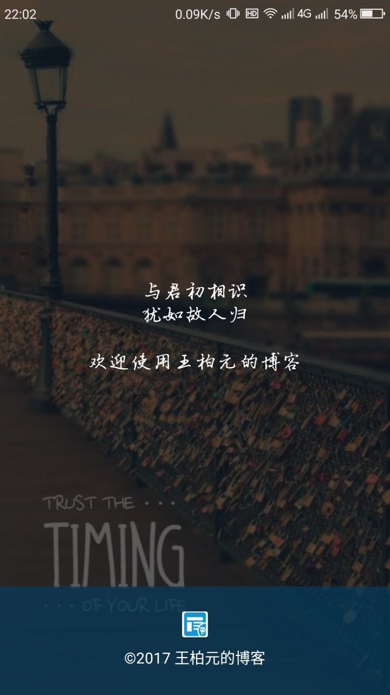
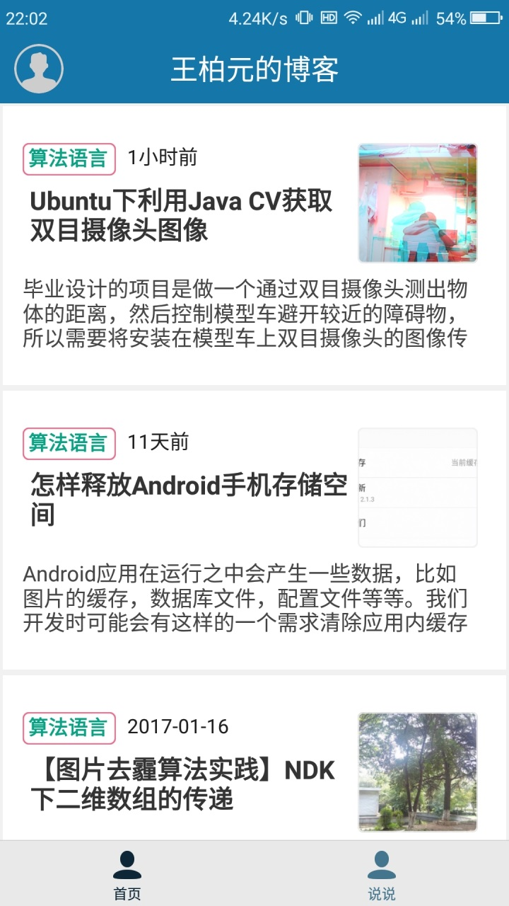
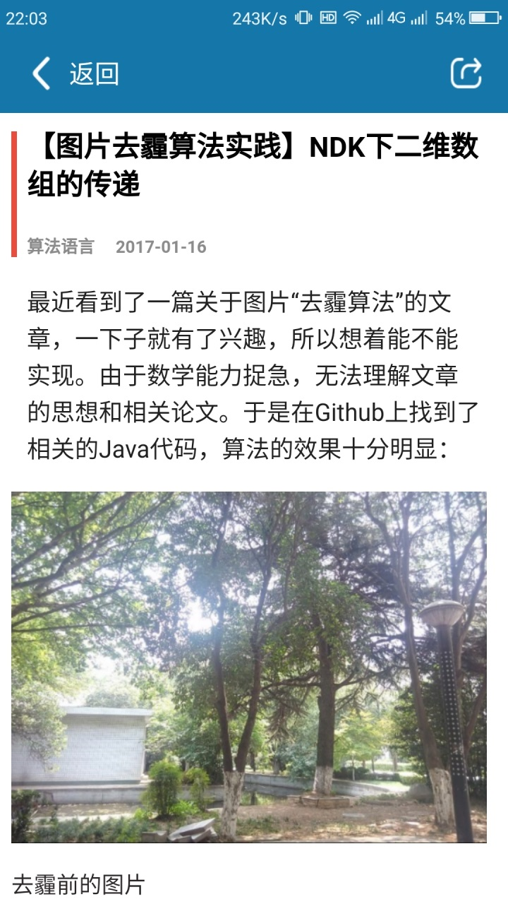
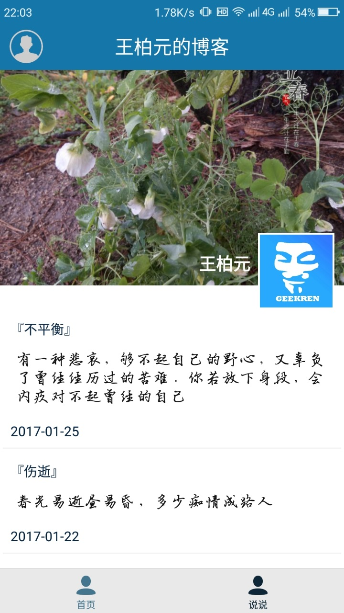
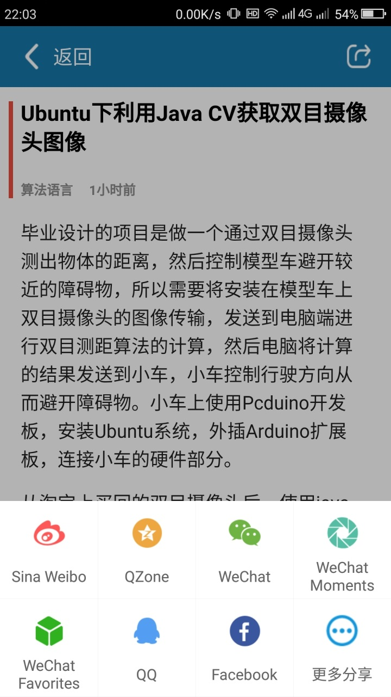

# BYBolg-open v2.0
>Android-end app of my blog(王柏元的博客),you can view posts of my blog([http://wangbaiyuan.cn](http://wangbaiyuan.cn)), This is an Android Project based on React Native,and the code of server-end is based on wordpress v4.7 or later.
of course,you can check out this and develop your own app of your wordpress website,what you should take a care is that your wordpress 
website should support **REST API -V2.0**,REST API -V2.0 offer the data for android app.fortunately, the support of **REST API V2.0**has been built in wordpressv4.7 and later.

## 预览

